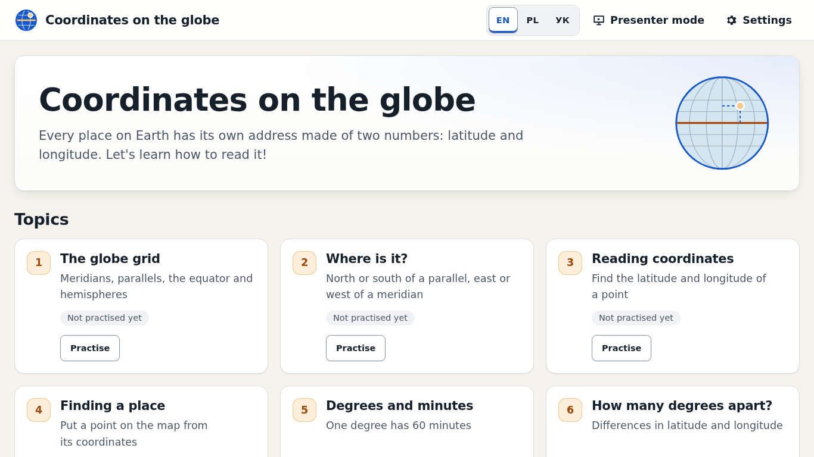
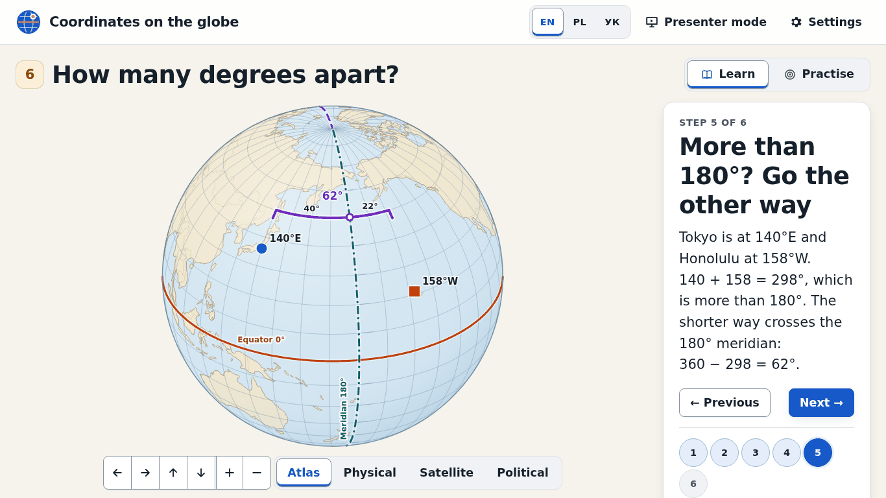
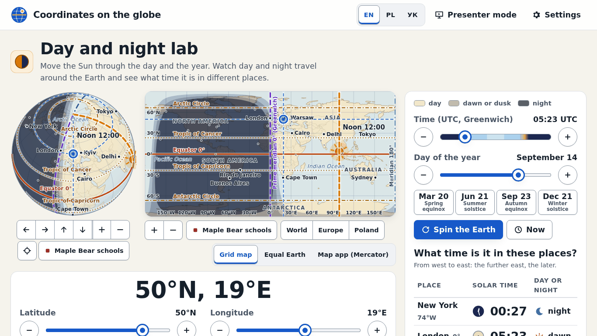

# Coordinates on the globe · Współrzędne · Координати

An interactive lesson about geographic coordinates for 6th graders, in English, Polish and Ukrainian.
One self-contained file — works offline, on phones, tablets, laptops and big classroom screens.

**Live demo (GitHub Pages):** <https://xsavikx.github.io/geo-coordinates/>

## Use it

Open `dist/geo-coordinates.html` in any modern browser (double-click works — no internet needed).

- **Learn**: 9 topics with step-by-step interactive explanations, from the basics of the
  grid to reading coordinates from a phone map app.
- **Practise**: 10-question rounds with instant feedback (easy / medium / hard) for topics 1–8,
  with a hint button for unanswered questions and a celebration on a perfect round.
- **Test rehearsal**: 15 mixed questions with a review at the end.
- **Class quiz**: big-screen questions; the same quiz code gives the same questions.
- **Day and night lab**: real sun position and local solar time.
- **Maps**: Grid, Equal Earth and Mercator (map-app style) flat projections, plus a globe with
  zoom; a detailed Central Europe view with deep zoom for street-level practice.
- **Maple Bear schools layer**: an optional map layer showing Maple Bear school locations
  around the world, for a real-world "find the coordinates" exercise.
- **Presenter mode**: press `P` (fullscreen, larger text, higher contrast); `L` toggles a
  pointer highlight — built for teaching from the front of a classroom.
- **Cheat sheet**: a printable, one-page-per-language summary of every rule, with small
  diagrams — "Print / Save as PDF" from the page.
- **Worksheet**: pick topics, difficulty and question count, get a printable worksheet with a
  matching answer key; the same code always produces the same sheet.
- Progress badges on the home screen show your best score per topic.

Share a topic directly with a link such as `geo-coordinates.html#pl/topic-3/explore`.

This page is an independent educational resource and is **not affiliated with Maple Bear or
Google** — both names appear only as real-world examples (a school locator and a map app).

## Translations

`dist/translation-review.html` lists every text side by side for native-speaker review.
Texts live in `src/i18n/{en,pl,uk}.json`; a test enforces that all three languages define the
same set of keys.

## Develop

    npm install
    npm run dev      # local dev server
    npm run check    # svelte-check (types)
    npm test         # unit tests (geography math, generators, i18n)
    npm run build    # dist/geo-coordinates.html + dist/translation-review.html
    npm run e2e      # Playwright + axe accessibility tests against the built file
    npm run shot     # take reference screenshots (used for docs/screenshots)

## Author

Created by **Yurii Serhiichuk**.

- Website: <https://serhiichuk.dev>
- GitHub: <https://github.com/xSAVIKx>

Author details for the page footer live in `src/app/credits.ts`.

## License

- **Code** (everything under `src/`, `scripts/`, config files, and the compiled
  `dist/*.html`): [MIT](LICENSE), © 2026 Yurii Serhiichuk.
- **Lesson content** (texts, translations, cheat sheet and worksheet content):
  [CC BY 4.0](LICENSE-CONTENT.md).

## Credits

- Map data: [Natural Earth](https://www.naturalearthdata.com/) (public domain), via
  [world-atlas](https://github.com/topojson/world-atlas).
- Maple Bear school locations: collected from publicly published Maple Bear school websites;
  see [`LICENSE-CONTENT.md`](LICENSE-CONTENT.md) for the trademark and affiliation note.
- Author: Yurii Serhiichuk — [serhiichuk.dev](https://serhiichuk.dev) ·
  [GitHub](https://github.com/xSAVIKx).

## Publishing

The built file is static. `dist/` is committed for offline use. GitHub Pages is served from a
GitHub Actions workflow (`.github/workflows/pages.yml`) that builds the project and publishes
`dist/geo-coordinates.html` as `index.html`, alongside `dist/translation-review.html`. See
[`docs/RELEASE.md`](docs/RELEASE.md) for the release checklist and the exact commands to
create the repository and enable Pages.
